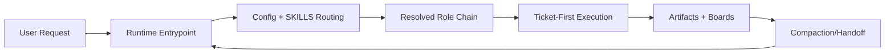

# src_architecture

## Metadata
- Document type: system architecture
- Status: starter baseline
- Last verified at: 2026-02-19T00:00:00Z

## Scope and Intent
This file captures a durable architecture map for the Context Compass
policy/docs system so future design updates can start from a stable baseline.

## DO NOT ASSUME / Unknowns Gate
- Any unevidenced runtime behavior remains UNKNOWN.
- Promote UNKNOWN to FACT only with direct file evidence.

## Unknowns
- UNKNOWN: packaging expectations for single-folder distribution versus split runtime distribution.
- UNKNOWN: long-term conventions for cross-runtime file naming compatibility.

## System Context (C4)
Context Compass is a file-backed operating model for AI work execution.
It coordinates onboarding, role routing, ticket memory, and compaction recovery.

## System Boundary and External Interfaces
- Runtime entrypoint interface: `AGENTS.MD` or `GEMINI.MD`
- Routing/config interface: `config/context_compass_config.yaml` and `SKILLS.MD`
- Durable execution interface: `attention_board.md`, `tickets/`, `artifact_board.md`

## Architecture Summary (C4)
- Policy bootstrap layer: runtime entrypoint + execution contract.
- Role routing layer: profile map and parent-first SKILLS inheritance.
- Execution memory layer: attention board + ticket notes.
- Artifact lifecycle layer: artifact board + retention/disposition controls.

## Entrypoints and Runtime Guardrails
- Entrypoint policy must be read before tools/edits.
- Certification token gates implementation actions.
- Re-onboarding gates post-compaction execution.

## Boot and Configuration Sequence
1. Runtime entrypoint policy read.
2. Configuration read from `config/context_compass_config.yaml`.
3. Role selection from `SKILLS.MD`.
4. Parent-first read of resolved role chain.
5. Certification request and approval.

## Data Flows and Sequences
- User request -> active ticket routing -> note capture -> implementation -> validation.
- Compaction event -> re-onboard -> re-certify -> resume from active ticket state.

## Operational Invariants
- Ticket notes are the canonical in-flight memory stream.
- Unknowns must remain explicit until proven.
- Role boundaries and inheritance remain deterministic.

## Failure Modes and Error Paths
- Missing required onboarding docs blocks certification.
- Stale or missing routing references produce non-deterministic role resolution.
- Unlinked artifacts can drift from ticket ownership.

## C1 Code Map (Core Only)
- path: `config/context_compass_config.yaml`
  start_line: 1
  end_line: 140
  loc: 140
  verified_at: 2026-02-19T00:00:00Z
- path: `SKILLS.MD`
  start_line: 1
  end_line: 90
  loc: 90
  verified_at: 2026-02-19T00:00:00Z
- path: `attention_board.md`
  start_line: 1
  end_line: 160
  loc: 160
  verified_at: 2026-02-19T00:00:00Z
- path: `agent_onboarding/default/general/skills/execution_contract.md`
  start_line: 1
  end_line: 260
  loc: 260
  verified_at: 2026-02-19T00:00:00Z

## Diagrams
ASCII:
```text
User -> Entrypoint Policy -> Config+Skills Router -> Role Chain -> Ticket Execution
                              |                                 |
                              +------ Compaction Re-entry ------+
```

Mermaid:


## Information Sources
- `AGENTS.MD` or `GEMINI.MD` (runtime package)
- `config/context_compass_config.yaml`
- `SKILLS.MD`
- `attention_board.md`
- `artifact_board.md`

## Context / Handoff Summary
This starter architecture defines a stable section contract and initial model.
Next reader should validate file/line ranges against current repository state.
