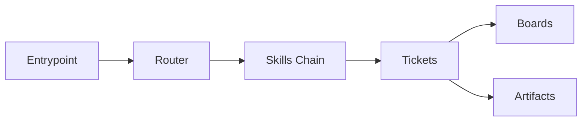

# src_components

## Metadata
- Document type: source components map
- Status: starter baseline
- Last verified at: 2026-02-19T00:00:00Z

## Scope
This file maps the core components used to operate Context Compass as a durable,
file-backed execution system.

## DO NOT ASSUME / Unknowns Gate
- Unknown component behavior remains UNKNOWN until direct evidence exists.
- Naming pattern alone is not evidence.

## Unknowns
- UNKNOWN: future ownership split for automation scripts vs policy docs.
- UNKNOWN: whether new profile overlays will add non-markdown executable assets.

## C3 Components Catalog
### Component: Runtime Policy Entrypoint
- Purpose: establish non-negotiable startup and gating behavior.
- Responsibilities: onboarding order, certification gates, compaction rules.
- Inputs: user request, runtime session state.
- Outputs: deterministic next-step policy.
- Owned State: none; policy text only.
- Lifecycle/Cleanup: re-read on fresh session or compaction.
- Concurrency/Threading: single-session coordination.
- Invariants/Guarantees: no execution before required reads and certification.
- Failure Modes: missing entrypoint file or policy drift.
- Observability: attestation messages and ticket notes.
- Extension Points: role-specific runtime overlays.
- Key Files (C1): `AGENTS.MD`, `GEMINI.MD`.

### Component: Router and Profile Resolution
- Purpose: map active profile to SKILLS chain.
- Responsibilities: deterministic role path resolution.
- Inputs: config profile values and role map.
- Outputs: resolved skill chain order.
- Owned State: role map definitions.
- Lifecycle/Cleanup: updated when roles are added/removed.
- Concurrency/Threading: single-writer documentation model.
- Invariants/Guarantees: parent-first skill inheritance.
- Failure Modes: broken path refs in role map.
- Observability: readable config and skills docs plus onboarding traces.
- Extension Points: user-defined profile overlays.
- Key Files (C1): `config/context_compass_config.yaml`, `SKILLS.md`.

### Component: Durable Work Memory
- Purpose: keep in-flight context durable outside chat memory.
- Responsibilities: route active work, hold findings, link artifacts.
- Inputs: active request, ticket updates, artifact outputs.
- Outputs: durable execution history and next step.
- Owned State: board rows and ticket note streams.
- Lifecycle/Cleanup: ticket close and artifact disposition rules.
- Concurrency/Threading: sequential updates with append-only note discipline.
- Invariants/Guarantees: active ticket notes are canonical in-flight memory.
- Failure Modes: stale board pointers, unlinked artifacts.
- Observability: board state + ticket history.
- Extension Points: additional ticket templates and artifact policies.
- Key Files (C1): `attention_board.md`, `artifact_board.md`, `tickets/*`.

## C2 Subcomponents Catalog
- Entrypoint policies: global runtime contract documents.
- Skill chain documents: general/engineer/specialized SKILLS and policies.
- Ticket lanes: epic/story/task docs with state transitions.
- Artifact lifecycle docs: artifact board and ticket artifact link sections.

## Method-Level Call Flows (C1)
- `bootstrap -> read_entrypoint -> read_config -> read_skills -> resolve_role_chain`
- `execute -> open_active_ticket -> append_note -> run_change -> append_validation`
- `compaction_recovery -> reonboard -> reread_active_state -> recertify -> resume`

## C1 Code Map (Core)
- path: `config/context_compass_config.yaml`
  start_line: 1
  end_line: 140
  loc: 140
  verified_at: 2026-02-19T00:00:00Z
- path: `SKILLS.md`
  start_line: 1
  end_line: 90
  loc: 90
  verified_at: 2026-02-19T00:00:00Z
- path: `tickets/tasks/README.md`
  start_line: 1
  end_line: 180
  loc: 180
  verified_at: 2026-02-19T00:00:00Z
- path: `attention_board.md`
  start_line: 1
  end_line: 160
  loc: 160
  verified_at: 2026-02-19T00:00:00Z

## Diagrams
```text
Entrypoint -> Router -> Skills Chain -> Ticket Memory -> Artifact Lifecycle
```



## Information Sources
- `config/context_compass_config.yaml`
- `SKILLS.md`
- `AGENTS.MD` and/or `GEMINI.MD`
- `attention_board.md`
- `tickets/*`

## Context / Handoff Summary
Starter component map added to satisfy C3/C2/C1 section contracts.
Next reader should replace example ranges with exact verified ranges.
