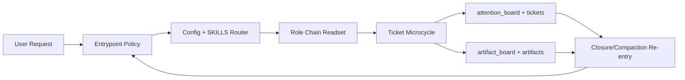

# src_architecture

> Starter mock document. This file ships as a template-quality baseline for
> agents and users. It is not authoritative repo-specific truth until it has
> been validated and rewritten against the current repository.

## Metadata
- Document type: system architecture
- Distribution baseline: codex
- Status: starter mock
- Last verified at: 2026-02-19T03:15:00Z
- Evidence policy: UNKNOWN-first with explicit source pointers

## Scope and Intent
This document demonstrates the expected shape of an architecture map for
Context Compass-style usage. It focuses on deterministic onboarding, role
routing, ticket-first execution memory, and continuity after
compaction/handoff.

In a fresh install, treat this as starter material. Replace or validate claims
before treating it as current repository truth.

## DO NOT ASSUME / Unknowns Gate
- File names are not proof of behavior.
- Claims are UNKNOWN until backed by direct file evidence.
- Cross-runtime assumptions must be validated in both adapter trees.

## Unknowns
- U-001 UNKNOWN: whether future adapters need new top-level entrypoint aliases.
  - Investigation target: `AGENTS.MD` and release packaging notes.
- U-002 UNKNOWN: whether reference scanning should be committed as automation.
  - Investigation target: release-hardening process docs.
- U-003 UNKNOWN: whether artifact retention defaults should vary by lane/profile.
  - Investigation target: `artifact_board.md` policy evolution.

## System Context (C4)
Context Compass sits between a runtime agent session and repository-backed state.
It converts volatile interaction into durable execution memory through explicit
contracts.

Primary actors and boundaries:
- user/operator requesting work
- runtime adapter entrypoint (`AGENTS.MD` for Codex sessions)
- role/router contract (`SKILLS.md`, `config/context_compass_config.yaml`)
- durable state (`attention_board.md`, `tickets/`, `artifact_board.md`)

## System Boundary and External Interfaces
- Entrypoint interface:
  - `AGENTS.MD`
- Routing/config interface:
  - `SKILLS.md`
  - `config/context_compass_config.yaml`
- Execution-memory interface:
  - `attention_board.md`
  - `tickets/epics/`, `tickets/stories/`, `tickets/tasks/`
- Artifact-lifecycle interface:
  - `artifact_board.md`
  - `artifacts/`

## Architecture Summary (C4)
Layer 1: Bootstrap and guardrails
- Entry documents enforce mandatory onboarding and certification gates.

Layer 2: Router and role-chain resolution
- Profile + role map resolve the active `SKILLS.md` chain in parent-first order.

Layer 3: Ticket microcycle execution
- Work runs through investigate -> document -> plan -> implement -> validate
  with append-only notes.

Layer 4: Closure and continuity
- Board sync and artifact disposition preserve deterministic re-entry.

## Entrypoints and Runtime Guardrails
- No action before required onboarding reads.
- Certification gate is explicit and required before execution.
- Re-onboarding is required after compaction/handoff.
- Unknown-first evidence discipline is mandatory.

## Boot and Configuration Sequence
1. Read `AGENTS.MD`.
2. Read execution contract and compaction requirements.
3. Read `config/context_compass_config.yaml`.
4. Read top-level `SKILLS.md` and resolve role.
5. Read resolved role-chain `SKILLS.md` files in parent-first order.
6. Confirm certification approval.
7. Route to active ticket via `attention_board.md`.
8. Execute ticket microcycle with evidence-backed notes.
9. On closure, sync board state and apply artifact disposition.

## Data Flows and Sequences
Flow A: Fresh session
- request -> entrypoint -> router/config -> role-chain readset -> certification -> ticket execution.

Flow B: Active execution
- active ticket -> investigate -> note -> plan -> implement -> validate -> note.

Flow C: Compaction recovery
- compaction event -> re-open entrypoint/contract -> re-read active state -> recertify -> resume.

Flow D: Ticket closure
- acceptance confirmation -> closure sync -> artifact disposition -> handoff summary.

## Operational Invariants
- I-001: Ticket notes are canonical in-flight memory.
- I-002: UNKNOWN is never promoted without evidence.
- I-003: Role-chain reads are explicit and parent-first.
- I-004: Certification precedes execution.
- I-005: Example lanes remain separate from operational lanes.

## Failure Modes and Error Paths
- F-001 Broken references
  - Signal: unresolved path/link checks.
  - Mitigation: normalize paths and rerun scans.

- F-002 Onboarding claims without proof
  - Signal: attestation without referenced readset.
  - Mitigation: require explicit evidence pointers.

- F-003 Ticket routing drift
  - Signal: stale or ambiguous `attention_board.md` pointers.
  - Mitigation: closure sync and board hygiene rules.

- F-004 Example pollution in real lanes
  - Signal: sample files placed under operational `tickets/` or `artifacts/`.
  - Mitigation: keep samples inside `examples/example_*` only.

## C1 Code Map (Core Only)
- path: `AGENTS.MD`
  start_line: 1
  end_line: 176
  loc: 176
  verified_at: 2026-02-19T03:15:00Z
- path: `SKILLS.md`
  start_line: 1
  end_line: 68
  loc: 68
  verified_at: 2026-02-19T03:15:00Z
- path: `config/context_compass_config.yaml`
  start_line: 1
  end_line: 136
  loc: 136
  verified_at: 2026-02-19T03:15:00Z
- path: `attention_board.md`
  start_line: 1
  end_line: 33
  loc: 33
  verified_at: 2026-02-19T03:15:00Z
- path: `artifact_board.md`
  start_line: 1
  end_line: 31
  loc: 31
  verified_at: 2026-02-19T03:15:00Z
- path: `agent_onboarding/default/general/skills/execution_contract.md`
  start_line: 1
  end_line: 234
  loc: 234
  verified_at: 2026-02-19T03:15:00Z
- path: `agent_onboarding/default/general/skills/workflow.md`
  start_line: 1
  end_line: 245
  loc: 245
  verified_at: 2026-02-19T03:15:00Z

## Diagrams
```text
User Request
  -> Entrypoint Policy
    -> Config + SKILLS Router
      -> Role Chain Readset
        -> Ticket Microcycle
          -> Attention Board + Artifact Board
            -> Closure / Compaction Re-entry
```



## Information Sources
- `AGENTS.MD`
- `SKILLS.md`
- `config/context_compass_config.yaml`
- `agent_onboarding/default/general/skills/execution_contract.md`
- `agent_onboarding/default/general/skills/workflow.md`
- `attention_board.md`
- `artifact_board.md`

## Context / Handoff Summary
Architecture is now explicitly tied to this repository's real lifecycle and
paths. Revalidate route/entrypoint references before future release updates.
