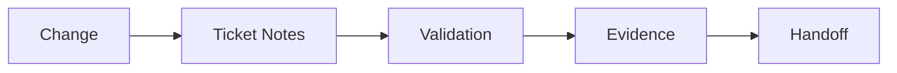

# tests_architecture

> Starter mock document. This file ships as a template-quality baseline for
> agents and users. It is not authoritative repo-specific truth until it has
> been validated and rewritten against the current repository.

## Metadata
- Document type: tests architecture
- Status: starter mock
- Last verified at: 2026-02-19T00:00:00Z

## Scope and Intent
Capture how test surfaces could be structured and validated for Context Compass.

In a fresh install, treat this as starter material. Replace or validate claims
before treating it as current repository truth.

## DO NOT ASSUME / Unknowns Gate
- Treat unverified test behavior as UNKNOWN.
- Promote to FACT only with direct test-file evidence.

## Unknowns
- UNKNOWN: final CI profile matrix for runtime-specific docs.
- UNKNOWN: long-term test marker taxonomy for integration vs component tests.

## System Context (C4)
Testing validates policy integrity, routing correctness, and durable ticket flow.

## External Interfaces and Entry Points
- Test framework: pytest guidance in user-defined testing docs.
- Validation commands: rg/yaml checks and ticket-based evidence checks.

## Core Responsibilities
- Ensure onboarding/routing references resolve.
- Ensure required section contracts remain present in system docs.
- Ensure examples remain consistent with policy documents.

## Data Flows and Lifecycle
- Authoring change -> update docs/examples -> run checks -> attach evidence.
- Compaction/handoff -> re-open active ticket -> validate stale assumptions.

## Invariants and Guarantees
- Validation status must be reported truthfully.
- Unknowns are explicit before any promotion to FACT.

## C1 Code Map (Key Paths)
- path: `agent_onboarding/user_defined/synaptic_python_developer/skills/testing/testing_overview.md`
  start_line: 1
  end_line: 220
  loc: 220
  verified_at: 2026-02-19T00:00:00Z
- path: `templates/task_template.md`
  start_line: 1
  end_line: 120
  loc: 120
  verified_at: 2026-02-19T00:00:00Z
- path: `tickets/tasks/README.md`
  start_line: 1
  end_line: 180
  loc: 180
  verified_at: 2026-02-19T00:00:00Z

## Diagrams
```text
Change -> Ticket Note -> Validation -> Evidence -> Handoff
```



## Information Sources
- `agent_onboarding/user_defined/synaptic_python_developer/skills/testing/*`
- `templates/*`
- `tickets/*/README.md`

## Context / Handoff Summary
Starter tests architecture created to replace placeholder state.
Next step is to bind key paths to exact package test commands.
