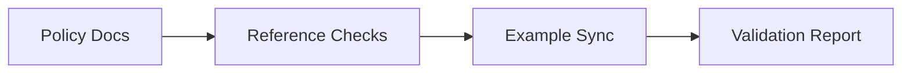

# tests_components

> Starter mock document. This file ships as a template-quality baseline for
> agents and users. It is not authoritative repo-specific truth until it has
> been validated and rewritten against the current repository.

## Metadata
- Document type: tests components map
- Status: starter mock
- Last verified at: 2026-02-19T00:00:00Z

## Scope
Map test-oriented components and flows that could be used to verify Context
Compass behavior.

In a fresh install, treat this as starter material. Replace or validate claims
before treating it as current repository truth.

## DO NOT ASSUME / Unknowns Gate
- New test component claims default to UNKNOWN.
- Only direct evidence can promote claims to FACT.

## Unknowns
- UNKNOWN: definitive boundary between component and integration suites.
- UNKNOWN: required fixture catalog for all role overlays.

## C3 Components Catalog
### Component: Contract Validation Layer
- Purpose: assert policy and routing contract integrity.
- Responsibilities: detect broken refs, missing sections, stale docs.
- Inputs: markdown/yaml policy files.
- Outputs: pass/fail findings.
- Owned State: validation artifacts and note evidence.
- Lifecycle/Cleanup: regenerated per review cycle.
- Concurrency/Threading: sequential in docs-first workflow.
- Invariants/Guarantees: findings must include file references.
- Failure Modes: false confidence from partial checks.
- Observability: ticket validation notes.
- Key Files (C1): `templates/*.md`, `tickets/*/README.md`.

### Component: Example Consistency Layer
- Purpose: ensure examples align with active policies.
- Responsibilities: keep starter docs and flow examples coherent.
- Inputs: role-level examples and system docs.
- Outputs: synchronized example set.
- Owned State: example markdown and python snippets.
- Lifecycle/Cleanup: refresh on policy/model changes.
- Concurrency/Threading: single-writer docs updates.
- Invariants/Guarantees: examples must not contradict gating policy.
- Failure Modes: stale examples that route users incorrectly.
- Observability: docs diff and review findings.
- Key Files (C1): `examples/*`, `agent_onboarding/*/examples/*`.

## C2 Subcomponents Catalog
- Reference integrity checks.
- Section-contract checks.
- Example-flow checks.
- Test-snippet checks for user-defined python overlay.

## Method-Level Call Flows (C1)
- `scan_refs -> resolve_paths -> report_missing`
- `validate_sections -> compare_required_headers -> report_gaps`
- `review_examples -> compare_with_policy -> update_docs`

## C1 Code Map (Key Paths)
- path: `agent_onboarding/user_defined/synaptic_python_developer/examples/python/pytest_unit_examples.py`
  start_line: 1
  end_line: 120
  loc: 120
  verified_at: 2026-02-19T00:00:00Z
- path: `agent_onboarding/user_defined/synaptic_python_developer/examples/python/pytest_integration_examples.py`
  start_line: 1
  end_line: 120
  loc: 120
  verified_at: 2026-02-19T00:00:00Z
- path: `agent_onboarding/user_defined/synaptic_python_developer/examples/python/pytest_component_examples.py`
  start_line: 1
  end_line: 120
  loc: 120
  verified_at: 2026-02-19T00:00:00Z

## Diagrams
```text
Policy/Docs -> Reference Checks -> Example Sync -> Validation Report
```



## Information Sources
- `agent_onboarding/user_defined/synaptic_python_developer/skills/testing/*`
- `agent_onboarding/user_defined/synaptic_python_developer/examples/python/*`
- `examples/*`

## Context / Handoff Summary
Starter tests component mapping added with explicit contracts and UNKNOWNs.
Next reader should replace estimated ranges with exact measured ranges.
