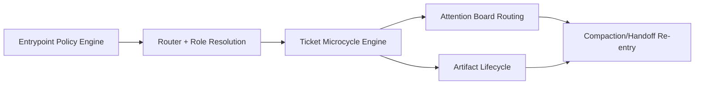

# src_components

## Metadata
- Document type: source components map
- Distribution baseline: gemini
- Status: current
- Last verified at: 2026-02-19T03:15:00Z

## Scope
This map describes the core C3/C2/C1 components that implement Context Compass
workflow behavior in this repository.

## DO NOT ASSUME / Unknowns Gate
- Component ownership is UNKNOWN until source-backed.
- Never infer behavior from naming alone.

## Unknowns
- U-101 UNKNOWN: should reference scanning become a committed script layer?
  - Investigation target: release-hardening process docs.
- U-102 UNKNOWN: should artifact disposition defaults vary by role lane?
  - Investigation target: `artifact_board.md` history and policy updates.

## C3 Components Catalog
### Component: Entrypoint Policy Engine
- Purpose: enforce startup and gating rules before execution.
- Responsibilities: onboarding order, certification gate, compaction re-entry requirements.
- Inputs: user request + runtime entrypoint document.
- Outputs: allowed action boundary.
- Owned State: none (policy-as-document contract).
- Lifecycle/Cleanup: re-read at session start and after compaction.
- Invariants/Guarantees: no work before mandatory reads/certification.
- Failure Modes: skipped gate, stale entrypoint references.
- Observability: attestation evidence in notes.
- Key Files (C1): `GEMINI.md`.

### Component: Router and Role Resolution Engine
- Purpose: resolve active role chain deterministically.
- Responsibilities: map active profile -> role path -> inherited `SKILLS.md` chain.
- Inputs: `config/context_compass_config.yaml`, `SKILLS.md`.
- Outputs: ordered readset and role boundaries.
- Owned State: role map and active profile config.
- Lifecycle/Cleanup: update when profiles/roles change.
- Invariants/Guarantees: parent-first role-chain resolution.
- Failure Modes: broken role map path, casing mismatch.
- Observability: resolved-chain notes during onboarding.
- Key Files (C1): `config/context_compass_config.yaml`, `SKILLS.md`.

### Component: Ticket Microcycle Execution Engine
- Purpose: run work as evidence-backed iteration.
- Responsibilities: enforce investigate/document/plan/implement/validate cadence.
- Inputs: active ticket + findings from source reads.
- Outputs: append-only notes, state transitions, validation records.
- Owned State: ticket `## Notes` and state sections.
- Lifecycle/Cleanup: per ticket until closure/completed move.
- Invariants/Guarantees: meaningful findings are documented before deeper expansion.
- Failure Modes: undocumented decisions, speculative transitions.
- Observability: task/story/epic notes and transition events.
- Key Files (C1): `tickets/*`, `templates/*`, `agent_onboarding/default/general/skills/workflow.md`.

### Component: Attention Board Routing Engine
- Purpose: keep active-work pointers deterministic.
- Responsibilities: active route pointer, closure anchors, re-entry hints.
- Inputs: ticket lifecycle updates.
- Outputs: current active pointer and recent closure anchors.
- Owned State: `attention_board.md` table rows.
- Lifecycle/Cleanup: updated on route change and closure.
- Invariants/Guarantees: active pointer maps to executable ticket context.
- Failure Modes: stale pointers, ambiguous active row.
- Observability: board row timestamps and linked tickets.
- Key Files (C1): `attention_board.md`.

### Component: Artifact Lifecycle Engine
- Purpose: track artifacts linked to ticket execution.
- Responsibilities: maintain ticket-artifact associations and disposition decisions.
- Inputs: ticket artifact links and close-state decisions.
- Outputs: active/cleared artifact index.
- Owned State: `artifact_board.md` entries.
- Lifecycle/Cleanup: updated through ticket execution and closure.
- Invariants/Guarantees: every active artifact has a ticket owner and disposition.
- Failure Modes: orphaned artifacts, unresolved disposition.
- Observability: active artifact table + cleared history.
- Key Files (C1): `artifact_board.md`, `artifacts/`.

## C2 Subcomponents Catalog
- Entrypoint Policy Engine
  - bootstrap sequence checker
  - certification gate checker
  - compaction re-entry checker

- Router and Role Resolution Engine
  - active profile reader
  - role map resolver
  - parent-first chain reader

- Ticket Microcycle Execution Engine
  - note appender
  - transition recorder
  - validation reporter

- Attention Board Routing Engine
  - active pointer updater
  - closure anchor updater

- Artifact Lifecycle Engine
  - artifact linker
  - disposition recorder
  - cleared-history logger

## Method-Level Call Flows (C1)
- `bootstrap_session() -> read_entrypoint() -> read_config() -> read_top_level_skills() -> resolve_role_chain()`
- `open_active_ticket() -> investigate() -> append_note() -> plan() -> implement() -> validate() -> append_note()`
- `close_ticket() -> confirm_acceptance() -> sync_attention_board() -> apply_artifact_disposition() -> append_handoff_summary()`
- `recover_from_compaction() -> reread_entrypoint() -> reread_active_ticket() -> recertify() -> resume()`

## C1 Code Map (Core)
- path: `templates/epic_template.md`
  start_line: 1
  end_line: 129
  loc: 129
  verified_at: 2026-02-19T03:15:00Z
- path: `templates/story_template.md`
  start_line: 1
  end_line: 111
  loc: 111
  verified_at: 2026-02-19T03:15:00Z
- path: `templates/task_template.md`
  start_line: 1
  end_line: 103
  loc: 103
  verified_at: 2026-02-19T03:15:00Z
- path: `tickets/epics/README.md`
  start_line: 1
  end_line: 68
  loc: 68
  verified_at: 2026-02-19T03:15:00Z
- path: `tickets/stories/README.md`
  start_line: 1
  end_line: 68
  loc: 68
  verified_at: 2026-02-19T03:15:00Z
- path: `tickets/tasks/README.md`
  start_line: 1
  end_line: 67
  loc: 67
  verified_at: 2026-02-19T03:15:00Z
- path: `examples/eng_task_flow.md`
  start_line: 1
  end_line: 31
  loc: 31
  verified_at: 2026-02-19T03:15:00Z
- path: `examples/artifact_workflow.md`
  start_line: 1
  end_line: 20
  loc: 20
  verified_at: 2026-02-19T03:15:00Z

## Diagrams
```text
Entrypoint Policy
  -> Router/Role Resolution
    -> Ticket Microcycle
      -> Attention Board Routing
      -> Artifact Lifecycle
```



## Information Sources

- `GEMINI.md`
- `SKILLS.md`
- `config/context_compass_config.yaml`
- `templates/epic_template.md`
- `templates/story_template.md`
- `templates/task_template.md`
- `tickets/epics/README.md`
- `tickets/stories/README.md`
- `tickets/tasks/README.md`
- `examples/eng_task_flow.md`
- `examples/artifact_workflow.md`

## Context / Handoff Summary
Component map now reflects actual ownership, call flows, and failure paths for
this repository's workflow system.


